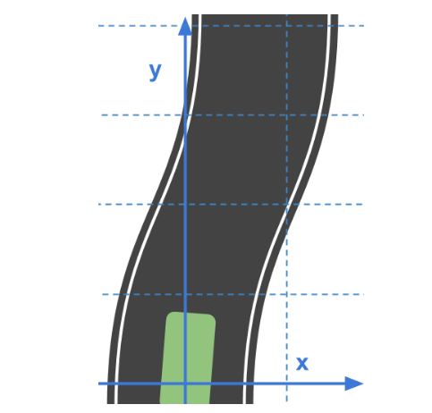
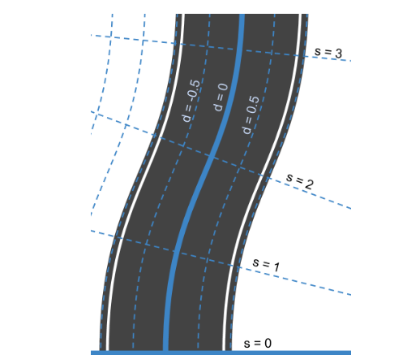
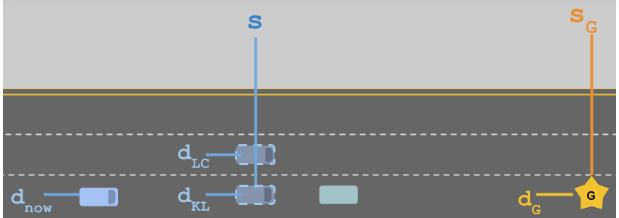
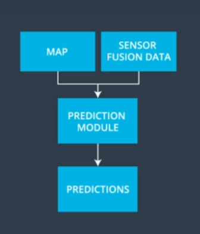
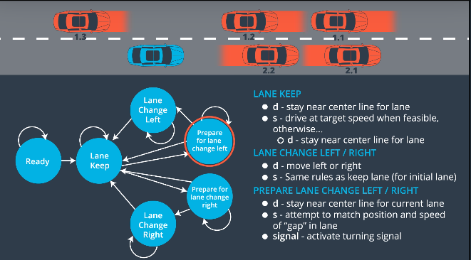

# **CarND-Highway-Planning-Project**  [](http://www.udacity.com/drive)


This project implements a path-planning algorithm that generates safe but efficient trajectories for an autonomous vehicle to execute along the simulated highway. 

## Project Details

1. The car uses a perfect controller and will visit every (x,y) point it recieves in the list every .02 seconds. The units for the (x,y) points are in meters and the spacing of the points determines the speed of the car. The vector going from a point to the next point in the list dictates the angle of the car. Acceleration both in the tangential and normal directions is measured along with the jerk, the rate of change of total Acceleration. The (x,y) point paths that the planner recieves should not have a total acceleration that goes over 10 m/s^2, also the jerk should not go over 50 m/s^3. (NOTE: As this is BETA, these requirements might change. Also currently jerk is over a .02 second interval, it would probably be better to average total acceleration over 1 second and measure jerk from that.

2. There will be some latency between the simulator running and the path planner returning a path, with optimized code usually its not very long maybe just 1-3 time steps. During this delay the simulator will continue using points that it was last given, because of this its a good idea to store the last points you have used so you can have a smooth transition. previous_path_x, and previous_path_y can be helpful for this transition since they show the last points given to the simulator controller with the processed points already removed. You would either return a path that extends this previous path or make sure to create a new path that has a smooth transition with this last path.


#### Highway Map
Inside `data/highway_map.csv` is a list of 181 waypoints that are located in the middle of the double-yellow dividing line. The points wrap around the entire track. Each point is a vector of the global Cartesion and Frenet coordinates as shown side by side below. 

The track is 6945.554 meters around (about 4.32 miles). If the car averages near 50 MPH, then it should take a little more than 5 minutes for it to go all the way around the highway.

The highway has 6 lanes total - 3 heading in each direction. Each lane is 4 m wide and the car should only ever be in one of the 3 lanes on the right-hand side. The car should always be inside a lane unless doing a lane change.

#### Waypoint Data
Each waypoint has an (x,y) global map position, and a Frenet s value and Frenet d unit normal vector (split up into the x component, and the y component).

The s value is the distance along the direction of the road. The first waypoint has an s value of 0 because it is the starting point.

The d vector has a magnitude of 1 and points perpendicular to the road in the direction of the right-hand side of the road. The d vector can be used to calculate lane positions. For example, if you want to be in the left lane at some waypoint just add the waypoint's (x,y) coordinates with the d vector multiplied by 2. Since the lane is 4 m wide, the middle of the left lane (the lane closest to the double-yellow dividing line) is 2 m from the waypoint.

Cartesian           |  Frenet
:-------------------------:|:-------------------------:
  |  


If you would like to be in the middle lane, add the waypoint's coordinates to the d vector multiplied by 6 = (2+4), since the center of the middle lane is 4 m from the center of the left lane, which is itself 2 m from the double-yellow dividing line and the waypoints.




#### Main car's localization Data (No Noise)

`["x"]` The car's x position in map coordinates

`["y"]` The car's y position in map coordinates

`["s"]` The car's s position in frenet coordinates

`["d"]` The car's d position in frenet coordinates

`["yaw"]` The car's yaw angle in the map

`["speed"]` The car's speed in MPH

#### Previous path data given to the Planner

**Note**: The previous path list will be returned but without the processed.

`["previous_path_x"]` The previous list of x points previously given to the simulator

`["previous_path_y"]` The previous list of y points previously given to the simulator

#### Previous path's end s and d values 

`["end_path_s"]` The previous list's last point's frenet s value

`["end_path_d"]` The previous list's last point's frenet d value

#### Sensor Fusion Data, a list of all other car's attributes on the same side of the road. (No Noise)

The sensor fusion variables carries all the relevant information for each car on the right-hand side of the road, namely its identifier and kinematic state parameters. 

`[sensor_fusion]` A 2d vector of cars and then that car's [car's unique ID, car's x position in map coordinates, car's y position in map coordinates, car's x velocity in m/s, car's y velocity in m/s, car's s position in frenet coordinates, car's d position in frenet coordinates. 


### Model Structure 
The algorithm accomplishes several main functionalities:   


1. <b>Process input data from sensor fusion and highway map.</b> At the start of the program, class ```EgoVehicle``` within ```vehicle.cpp``` is instantiated, which then allows initialization of the self-driving car (SDC), also referred to as Ego, with data drawn from the sensor fusion regarding its own state. Furthermore, it invokes the OtherVehicle class method to perform the same state initialization for other cars on the road.

2. <b>Determine lane change.</b> The model will track the lane positions, distance w.r.t to the SDC, and velocities of neighboring vehicles in its current, left, or right lane through ```lane_tracker.cpp```. This class is also where the SDC can retrieve and decide among a finite number of states: stay in current lane, change left, and change right. Additionally, it keeps track of the distance between itself and the car ahead and will try to change lanes when the value is below a safety criteria. Otherwise, it will remain in the same lane with a more conservative following speed. 

*`NOTE:`In reality, the model would need to generate finer grained predictions that extend to a horizon of 10-20 seconds. Additionally, predictions should be made for **all** dynamic objects.

3. <b>Generate a trajectory based on feedback.</b> Once it has determined its target state, ```trajectory_planner.cpp``` generates a path line of points ahead at 30, 60, and 90m. The Frenet coordinates are converted back to Cartesian ```getXY()``` before getting passed to a spline function where they can be interpolated. The vehicle, however, may not traverse all these points within the given feedback cycle time window or due to traffic circumstances. These remaining points can be used to generate the next path for a smoother transition.

 
<figure class="image">
  
  <figcaption>Here is a high-level process flow of the model.</figcaption>
</figure>


<figure class="image">
  
  <figcaption>Depiction of the finite state machine (FSM), a logic structure that underlies the vehicle's decision making. 
</figcaption>
</figure>


<!--<span style="display:block;text-align:center">-->

### Results 
In the autonomous mode, the vehicle was able to exceed at least 5.5 miles without collision. See demo above.  

### Conclusion 
Although it had met requirements, there were close encounters that could be tuned in the model. For example, during lane transitions, the car had sometimes narrowly missed a neighboring car as it turned into and cut ahead. In this current model, it was assumed that other vehicles were moving at constant velocity; however, realistically, the algorithm should be tracking accelerations of other cars. Additionally, the target lane should not by default look to change left and then right in that sequence. It should be situational as the fast lane is generally the leftmost lane. Especially in cases where we have more than 3 lanes and a non-circular path where the car may need to take an exit, this model would probably benefit from a different architecture to store that more elaborate cost function. Finite states may start to multiply and managing them can become quite complicated.  


## Dependencies

* cmake >= 3.5
 * All OSes: [click here for installation instructions](https://cmake.org/install/)
* make >= 4.1
  * Windows: [Click here for installation instructions](http://gnuwin32.sourceforge.net/packages/make.htm)
* gcc/g++ >= 5.4
  * Windows: recommend using [MinGW](http://www.mingw.org/)
* [uWebSockets](https://github.com/uWebSockets/uWebSockets)

## Basic Build Instructions

1. Clone this repo.
2. Make a build directory: `mkdir build && cd build`
3. Compile: `cmake .. && make`
4. Run it: `./path_planning`


